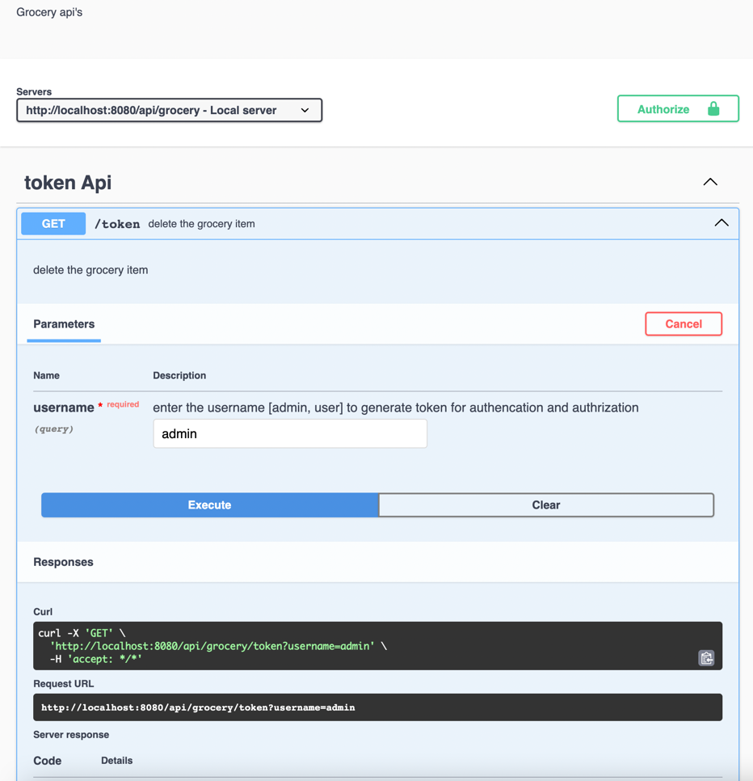

# Grocery Booking API


## Api documentation
http://localhost:8080/api/grocery/api-docs/ 

## Authentication

```bash
//mock data to authenticate
[
{ id: "1", username: "admin", role: UserRole.ADMIN },
{ id: "2", username: "user", role: UserRole.USER },
]

//to get admin token
curl -X 'GET' \
  'http://localhost:8080/api/grocery/token?username=admin' \
  -H 'accept: */*'

//to get user token
curl -X 'GET' \
  'http://localhost:8080/api/grocery/token?username=user' \
  -H 'accept: */*'

```
## assumtions
1-user and admin are authenticated and authorized using jwt token\
2-roles are fetched from username (we have mocked the data for that)\


## steps to check api's

a-run npm install\
b-set node_env to set specific config (prod,qa etc)\
c-go to api-docs http://localhost:8080/api/grocery/api-docs/ to test api\
\

d-generate token using token api (username:admin or username:user) to access respceted api's\
e- to build docker use command docker build . -t tsdocker (make sure to set proper env value in docker file)\
f- to run docker docker run -p 3000:3000 tsdocker

